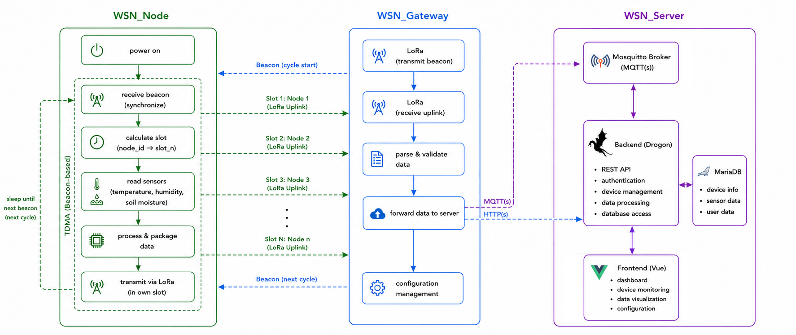

# Wireless Sensor Network - WSN

> Design a wireless sensor network for monitoring temperature, humidity,
> and soil moisture in agricultural fields.

## Overview

This project measures environmental properties commonly used in
agricultural applications, such as `temperature`, `humidity`, and
`soil moisture`. It uses an `SHT31` sensor and a `capacitive soil moisture`
sensor to monitor temperature, humidity, and soil moisture at the
`wsn_node`, which then sends the collected data to the `wsn_gateway` via
the `LoRa` protocol. The `wsn_gateway` forwards the data to the
`wsn_server`, choosing between `HTTP(s)` or `MQTT(s)` via the gateway's
configuration portal. The `wsn_server` handles and stores the data,
exposing it to a frontend for users.



## Structure
| Branch         | Contents                           |
|----------------|------------------------------------|
| `wsn_docs`     | Documentation                      |
| `wsn_node` (comming soon)    | Node firmware                      |
| `wsn_gateway`  | Gateway firmware                   |
| `wsn_server`   | Server architecture & review notes |

## Getting Started
Each component lives on its own branch - clone the one you need.

### wsn_node (STM32)
```bash
git clone --branch wsn_node --single-branch https://github.com/hphuc15/wsn.git wsn_node
cd wsn_node
```

### wsn_gateway (ESP32)
```bash
git clone --branch wsn_gateway --single-branch https://github.com/hphuc15/wsn.git wsn_gateway
cd wsn_gateway
```

### wsn_server
The `wsn_server` branch contains architecture notes and review material for the backend and frontend rather than source code. See [Architecture](#architecture) above for how it fits into the system.

## Documentation

This branch contains the full documentation set:

- [`docs/architecture/`](.\docs\architecture) - system architecture & data flow
- [`docs/troubleshooting/`](./troubleshooting/) - known issues & debugging guides
- [`docs/setup/`](./setup/) - prerequisites & full configuration reference


## Tech Stack
`STM32Cube` · `ESP-IDF` · `FreeRTOS` · `LoRa` · `Drogon` · `MariaDB` · `MQTT(s)` · `HTTP(s)` · `Vue 3`

## License
This project is licensed under the [Apache License 2.0](LICENSE).